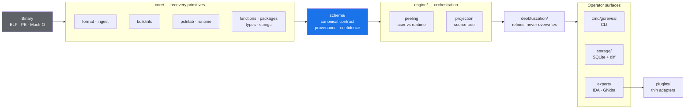

<div align="center">

<picture>
  <source
    media="(prefers-color-scheme: dark)"
    srcset="https://shieldcn.dev/header/graph.svg?title=GoREveal&amp;subtitle=Clean-room+reverse+engineering+for+Go+binaries&amp;logo=go&amp;align=center&amp;mode=dark&amp;theme=slate"/>
  
</picture>

<p>
  <a href="https://github.com/ioplane/goreveal/actions/workflows/ci.yml">
    </a>
  <a href="https://scorecard.dev/viewer/?uri=github.com/ioplane/goreveal">
    </a>
  <a href="https://go.dev/dl/">
    </a>
  <a href="https://github.com/ioplane/goreveal/blob/main/LICENSE">
    </a>
  <a href="https://github.com/ioplane/goreveal/releases/latest">
    </a>
  <a href="https://github.com/ioplane/goreveal/blob/main/docs/RELEASE.md">
    </a>
</p>

</div>

---

**GoREveal recovers structure from Go binaries — including stripped and
obfuscated ones — and hands it to your disassembler.**

Go binaries carry rich metadata: a function-to-line table, module data, type
descriptors, embedded build info. Strip the symbol table and most tools go quiet.
GoREveal reads what remains and grades how confident it is about each claim,
rather than guessing when the evidence is not there.

```console
$ goreveal inspect packages ./stripped-service | jq '.[0]'
{
  "name": "fmt",
  "import_path": "fmt",
  "source_file_count": 2,
  "function_count": 39,
  "has_source_evidence": true,
  "source_evidence_kind": "dwarf_paths",
  "provenance": {
    "source": "core.packages.functions",
    "confidence": "medium"
  }
}
```

Every field carries `provenance` and `confidence`. That is the point of the tool:
you can tell what was read from the binary, what was inferred, and what is simply
unknown.

## Contents

- [Why GoREveal](#why-goreveal)
- [Install](#install)
- [Usage](#usage)
- [How it works](#how-it-works)
- [Verifying what you downloaded](#verifying-what-you-downloaded)
- [Documentation](#documentation)
- [Development](#development)
- [Clean-room boundary](#clean-room-boundary)
- [Project status](#project-status)
- [Contributing](#contributing)
- [Security](#security)
- [License](#license)

## Why GoREveal

| | |
| --- | --- |
| **Evidence-graded output** | Every recovered fact carries a `provenance` source and a `confidence` level. Absent evidence yields `unavailable` or an empty result — never a plausible-looking guess. |
| **Works on stripped binaries** | Recovery falls back through `pclntab`, module data, and `.go.module` in a documented order, and reports which path it used. |
| **Obfuscation handled as refinement** | `garble`-style string and name refinement is a layer *on top of* raw truth, never a replacement for it. Raw values stay in the output. |
| **One canonical contract** | A single schema drives the CLI, SQLite storage, and the IDA and Ghidra adapters. The plugins consume it; they contain no recovery logic of their own. |
| **Build-to-build diffing** | Match functions between two builds with an explicit reason per match — `exact_name`, `source_location`, `source_file`, or `module_local_normalized_name` — plus a review queue for what needs human judgment. |
| **Verified releases** | Signed checksums, SPDX SBOMs, and SLSA build provenance on every tag. |

## Install

### Release binary

```bash
VERSION=0.1.0
BASE="https://github.com/ioplane/goreveal/releases/download/v${VERSION}"
curl -fsSLO "${BASE}/goreveal_${VERSION}_linux_amd64.tar.gz"
tar -xzf "goreveal_${VERSION}_linux_amd64.tar.gz"
./goreveal version
```

Verify the download before running it — see
[Verifying what you downloaded](#verifying-what-you-downloaded).

Prebuilt targets: `linux/amd64`, `linux/arm64`, `darwin/amd64`, `darwin/arm64`,
`windows/amd64`. Debian and RPM packages are published alongside the archives.

### Container

```bash
docker run --rm -v "$PWD:/work:ro,Z" \
  ghcr.io/ioplane/goreveal:latest analyze /work/target-binary
```

The image runs as a non-root user with no shell — appropriate for analyzing
samples you do not trust.

### From source

```bash
go install github.com/ioplane/goreveal/cmd/goreveal@latest
```

Requires Go 1.26 or newer. A `go install` build still reports truthful identity:
`goreveal version` falls back to the VCS stamps the toolchain embeds.

## Usage

```bash
goreveal help
```

### Analyze

`analyze` emits the full canonical document — input metadata, build info, runtime
evidence, functions, packages, types, and strings — as one JSON object.

```bash
goreveal analyze ./target
```

### Inspect one surface

When you want a single dimension rather than the whole document:

```bash
goreveal inspect functions ./target   # names, addresses, source location, package
goreveal inspect packages ./target    # import paths, module locality, source evidence
goreveal inspect types ./target       # recovered type descriptors
goreveal inspect strings ./target     # string candidates with absolute addresses
goreveal inspect runtime ./target     # module data and pclntab evidence
goreveal inspect peeling ./target     # user-versus-runtime classification
```

`inspect runtime` returns `unavailable` when the evidence is absent rather than
inventing runtime facts.

### Separate your code from the runtime

`peel` projects only the parts that are plausibly yours, filtering out the Go
runtime and standard library:

```bash
goreveal peel ./target
goreveal source-tree ./target   # reconstruct the package and file layout
```

`source-tree` degrades honestly: with DWARF it reports real paths; without it,
line-table-backed file evidence marked `pathless_file_evidence`; and failing
that, package nodes flagged `has_file_evidence: false`.

### Refine obfuscated output

```bash
goreveal deobfuscate ./garbled-target
```

Refined names and decoded strings are added; the raw recovered values remain in
the document.

### Export to your disassembler

```bash
goreveal export ida ./target     > goreveal-ida.json
goreveal export ghidra ./target  > goreveal-ghidra.json
goreveal export sqlite runs.db ./target
```

The payloads are self-describing and carry an explicit contract identifier
(`goreveal.export.ida/v1`, `goreveal.export.ghidra/v1`), so you can consume them
from your own tooling.

The bundled adapters validate a payload against its contract and turn it into an
ordered list of import actions:

```bash
python3 plugins/ida/goreveal_ida.py    goreveal-ida.json
python3 plugins/ghidra/goreveal_ghidra.py goreveal-ghidra.json
```

They are deliberately thin and contain no recovery logic. **Binding those actions
to the live IDA and Ghidra APIs is not implemented yet** — today the adapters are
a validated bridge you drive yourself, not a one-click import. See
[plugins/ida/README.md](plugins/ida/README.md) and
[plugins/ghidra/README.md](plugins/ghidra/README.md).

### Compare two builds

Store several runs in one SQLite database, then diff them:

```bash
goreveal export sqlite runs.db ./service-v1
goreveal export sqlite runs.db ./service-v2

goreveal diff sqlite runs.db 1 2           # matched functions, with a reason each
goreveal diff review sqlite runs.db 1 2    # queue of items needing human review
goreveal diff next sqlite runs.db 1 2      # recommended next review pass
goreveal diff handoff sqlite runs.db 1 2   # machine-readable workstation handoff
```

`diff next` is the one to start from: it carries the recommended actions, a review
checklist, progress counters, and the upcoming package horizon.

## How it works



Three rules hold this together, enforced in review and mechanically by `depguard`
in [`.golangci.yml`](.golangci.yml):

1. **`schema` is canonical.** Every surface projects it. Nothing re-derives it.
2. **`core` is independent.** No CLI, storage, or plugin concerns leak into it.
3. **Plugins consume exports.** Recovery logic never lives in `plugins/`.

## Verifying what you downloaded

Every release is covered by a signed checksum file and carries SLSA build
provenance.

```bash
VERSION=0.1.0
BASE="https://github.com/ioplane/goreveal/releases/download/v${VERSION}"
curl -fsSLO "${BASE}/goreveal_${VERSION}_checksums.txt"
curl -fsSLO "${BASE}/goreveal_${VERSION}_checksums.txt.sig"
curl -fsSLO "${BASE}/goreveal_${VERSION}_checksums.txt.pem"

sha256sum --check --ignore-missing "goreveal_${VERSION}_checksums.txt"

cosign verify-blob \
  --certificate "goreveal_${VERSION}_checksums.txt.pem" \
  --signature "goreveal_${VERSION}_checksums.txt.sig" \
  --certificate-identity-regexp \
    '^https://github\.com/ioplane/goreveal/\.github/workflows/release\.yml@refs/tags/v' \
  --certificate-oidc-issuer https://token.actions.githubusercontent.com \
  "goreveal_${VERSION}_checksums.txt"

gh attestation verify "goreveal_${VERSION}_linux_amd64.tar.gz" -R ioplane/goreveal
```

SPDX JSON SBOMs ship next to each archive. Full instructions, including container
image verification and how to reproduce a build, are in
[docs/RELEASE.md](docs/RELEASE.md).

## Documentation

| Topic | Document |
| --- | --- |
| Documentation index | [docs/README.md](docs/README.md) |
| Platform contract | [docs/architecture/0001-platform-contract.md](docs/architecture/0001-platform-contract.md) |
| Module map | [docs/architecture/0002-module-map.md](docs/architecture/0002-module-map.md) |
| Schema principles | [docs/architecture/0003-schema-principles.md](docs/architecture/0003-schema-principles.md) |
| Claim boundaries | [docs/architecture/0008-semantic-claim-boundaries.md](docs/architecture/0008-semantic-claim-boundaries.md) |
| Testing strategy | [docs/architecture/0004-testing-strategy.md](docs/architecture/0004-testing-strategy.md) |
| Go 1.26 engineering guide | [docs/architecture/0005-go126-best-practices.md](docs/architecture/0005-go126-best-practices.md) |
| Release and verification | [docs/RELEASE.md](docs/RELEASE.md) |
| Contributing | [CONTRIBUTING.md](CONTRIBUTING.md) |
| Security policy | [SECURITY.md](SECURITY.md) |

## Development

Development is Podman-first: the dev container pins every tool version, so local
results match CI.

```bash
git clone https://github.com/ioplane/goreveal.git
cd goreveal

podman build -f deployments/docker/Containerfile.dev -t localhost/goreveal:dev .
task build-image      # or through the Python automation entrypoint

task lint             # golangci-lint
task test             # Go suite plus Python unit tests
task lint-scripts     # ruff, ty, yamllint, shellcheck
task test-snapshots   # golden snapshots
```

Python tooling is managed with [uv](https://docs.astral.sh/uv/):

```bash
uv sync --group dev
uv run ruff check .
uv run ty check
```

Equivalent `make` targets exist. Full setup, including the baseline repositories
needed for differential tests, is in [CONTRIBUTING.md](CONTRIBUTING.md).

## Clean-room boundary

GoREveal studies the *observable behavior* of the prior art in this space —
`gore`, `redress`, `GoReSym`, `GoResolver`, `gostringungarbler`, `AlphaGolang` —
and converts that study into documented findings, corpus fixtures, and
differential tests.

**No implementation code from those projects is copied, translated, or derived
here.** The differential suite compares against them as an evidence source, not
as ground truth: a divergence is something to investigate, not automatically a
GoREveal defect.

This boundary is a licensing and review constraint, not a courtesy. See
[NOTICE](NOTICE) and
[CONTRIBUTING.md](CONTRIBUTING.md#1-clean-room-boundary).

## Project status

Pre-1.0 and under active development. The CLI surface and the canonical schema
are usable but not yet frozen; breaking contract changes bump the minor version
while the major version is `0`.

Honest assessment of the current capability envelope:

| Area | State |
| --- | --- |
| Stripped ELF recovery | Strong — functions, packages, source evidence |
| PE and Mach-O | Real function, package, and peeling footholds; narrower than ELF |
| `garble`-class obfuscation | Bounded address-level foothold; named-function recovery under custom `pclntab` magic is unresolved |
| Source reconstruction | DWARF paths when present, line-table file evidence otherwise, both explicitly labeled |
| Build-to-build diffing | Working, with explained matches and a review queue |
| IDA and Ghidra adapters | Contract-locked payloads and validating adapters; live host-API binding not implemented |
| Server mode | Not implemented; deferred by design |

## Contributing

Contributions are welcome. Start with [CONTRIBUTING.md](CONTRIBUTING.md) — it
covers the build, the verification gates, and the two rules that are genuinely
non-negotiable: the clean-room boundary, and never inventing recovery truth.

- [Report a bug](https://github.com/ioplane/goreveal/issues/new/choose) — wrong
  output is a bug, and a fixture makes it fixable
- [Request a capability](https://github.com/ioplane/goreveal/issues/new/choose)
- [Ask a question](https://github.com/ioplane/goreveal/discussions)
- [Code of Conduct](CODE_OF_CONDUCT.md) · [Support](SUPPORT.md) ·
  [Maintainers](MAINTAINERS.md)

## Security

Report vulnerabilities privately through a
[GitHub Security Advisory](https://github.com/ioplane/goreveal/security/advisories/new),
never in a public issue. Scope, threat model, and response targets are in
[SECURITY.md](SECURITY.md).

GoREveal parses hostile input by design. Run unknown samples in an isolated
container or VM.

## License

[Apache-2.0](LICENSE). See [NOTICE](NOTICE) for attribution and the clean-room
declaration.
