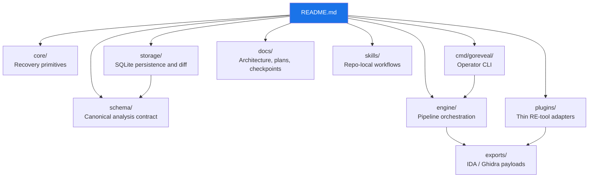

<p align="center">
  <strong>GoREveal</strong><br>
  Go-native reverse-engineering platform for binary recovery, trust, and transfer workflows
</p>

<p align="center">
  
  
  
  
</p>

---

GoREveal is a clean-room reverse-engineering platform for Go binaries.

It is being built as:
- a local autonomous tool for analyst workstations
- a future server platform for multi-tenant artifact analysis, trust-aware recovery, and report delivery
- a Go-native recovery and transfer layer that plugs into `IDA`, `Ghidra`, and later `JEB` and `Binary Ninja`

## Quick Start

```bash
# Clone
gh repo clone ioplane/goreveal
cd goreveal

# Build the dev container
podman build -f deployments/docker/Containerfile.dev -t goreveal:dev .

# Run verification
make fmt
make test
make lint
```

## Architecture



## Documentation

Core planning and architecture live under [docs/](docs/).

| Area | Entry Point |
|---|---|
| Platform contract | [docs/architecture/2026-03-19-goreveal-platform-contract.md](docs/architecture/2026-03-19-goreveal-platform-contract.md) |
| Go 1.26 practices | [docs/architecture/2026-03-19-goreveal-go126-best-practices.md](docs/architecture/2026-03-19-goreveal-go126-best-practices.md) |
| Testing strategy | [docs/architecture/2026-03-19-goreveal-testing-strategy.md](docs/architecture/2026-03-19-goreveal-testing-strategy.md) |
| Sprint / roadmap plan | [docs/plans/2026-03-19-goreveal-scrum-implementation-plan.md](docs/plans/2026-03-19-goreveal-scrum-implementation-plan.md) |
| Feature map | [docs/plans/2026-03-19-goreveal-feature-map.md](docs/plans/2026-03-19-goreveal-feature-map.md) |
| Progress assessment | [docs/plans/2026-03-20-goreveal-progress-assessment.md](docs/plans/2026-03-20-goreveal-progress-assessment.md) |
| Functional assessment | [docs/plans/2026-03-20-goreveal-functional-assessment.md](docs/plans/2026-03-20-goreveal-functional-assessment.md) |
| Deferred continuation | [docs/plans/2026-03-20-goreveal-deferred-continuation.md](docs/plans/2026-03-20-goreveal-deferred-continuation.md) |
| Runtime modes and storage ideas | [docs/plans/2026-03-21-goreveal-runtime-modes-and-storage-ideas.md](docs/plans/2026-03-21-goreveal-runtime-modes-and-storage-ideas.md) |
| MCP and artifact transfer ideas | [docs/plans/2026-03-21-goreveal-agent-mcp-and-artifact-transfer-ideas.md](docs/plans/2026-03-21-goreveal-agent-mcp-and-artifact-transfer-ideas.md) |
| Repo-local skills | [skills/README.md](skills/README.md) |

## Current Product Surface

- canonical schema-backed `analyze`
- `inspect functions`, `inspect runtime`, `inspect packages`, `inspect types`, `inspect strings`
- `source-tree`
- `deobfuscate`
- `export sqlite`, `export ida`, `export ghidra`
- SQLite persistence and stored-run diffing
- differential validation against `GoReSym`, `redress`, and `gore`
- thin `IDA` and `Ghidra` adapters

## Repository Rules

- clean-room boundary first; external tools inform behavior, not copied implementation
- schema-first outputs; operator surfaces should expose canonical truth, not plugin-local guesses
- Podman-first development and verification
- accuracy work outranks performance work
- plugin and server logic do not belong in `core`
- bounded runtime-semantic slices are valid; broad speculative parser rewrites are not

## Current Execution Lanes

| Lane | Reading |
|---|---|
| `Sprint 12` | Primary lane for bounded runtime-semantic depth and analyst-facing trust signals |
| `Sprint 7` | Maintenance lane for differential evidence and claim hygiene |
| `Sprint 11` | Completed usability checkpoint for package/type/source surfaces |
| Future platform epics | Server mode, `gorectl`, MCP surfaces, object-store-backed transfer, and multi-tenant artifact workflows |

## Verification

Current containerized entrypoints:
- `make fmt`
- `make test`
- `make lint`
- `make test-differential`
- `make test-differential-report`
- `make test-plugins`
- `make test-snapshots`

Development is Podman-first. See [deployments/docker/README.md](deployments/docker/README.md).
