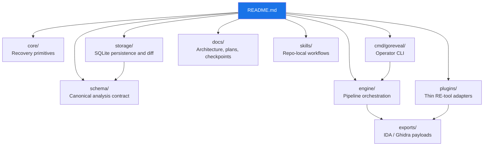

<p align="center">
  <strong>GoREveal</strong><br>
  Go-native reverse-engineering platform for binary recovery, trust, and transfer workflows
</p>

<p align="center">
  
  
  
  
</p>

---

GoREveal is a clean-room reverse-engineering platform for Go binaries.

It is being built as:
- a standalone local tool whose recovery, inspection, storage, diff, and export
  contracts do not depend on an RE suite
- a future server platform for multi-tenant artifact analysis, trust-aware recovery, and report delivery
- a Go-native recovery and transfer layer with optional `IDA`, `Ghidra`, and
  later `JEB` and `Binary Ninja` integrations

## Quick Start

```bash
# Clone
gh repo clone ioplane/goreveal
cd goreveal

# Build the dev container
podman build -f deployments/docker/Containerfile.dev -t goreveal:dev .

# Install Python automation helper
python3 -m pip install -e .

# Run verification
make fmt
make test
make lint
make lint-scripts
```

## Architecture



## Documentation

Core planning and architecture live under [docs/](docs/).

| Area | Entry Point |
|---|---|
| Active product design | [docs/superpowers/specs/2026-07-22-goreveal-rt1-product-design.md](docs/superpowers/specs/2026-07-22-goreveal-rt1-product-design.md) |
| Standalone release, SIMD, and IDA bootstrap refinement | [docs/superpowers/specs/2026-07-22-goreveal-standalone-release-ida-bootstrap-design.md](docs/superpowers/specs/2026-07-22-goreveal-standalone-release-ida-bootstrap-design.md) |
| Active Horizon A execution plan | [docs/superpowers/plans/2026-07-22-goreveal-rt1-horizon-a.md](docs/superpowers/plans/2026-07-22-goreveal-rt1-horizon-a.md) |
| Platform contract | [docs/architecture/2026-03-19-goreveal-platform-contract.md](docs/architecture/2026-03-19-goreveal-platform-contract.md) |
| Go 1.26 practices | [docs/architecture/2026-03-19-goreveal-go126-best-practices.md](docs/architecture/2026-03-19-goreveal-go126-best-practices.md) |
| Testing strategy | [docs/architecture/2026-03-19-goreveal-testing-strategy.md](docs/architecture/2026-03-19-goreveal-testing-strategy.md) |
| Historical Scrum delivery record | [docs/plans/2026-03-19-goreveal-scrum-implementation-plan.md](docs/plans/2026-03-19-goreveal-scrum-implementation-plan.md) |
| Feature map | [docs/plans/2026-03-19-goreveal-feature-map.md](docs/plans/2026-03-19-goreveal-feature-map.md) |
| Historical progress assessment | [docs/plans/2026-03-20-goreveal-progress-assessment.md](docs/plans/2026-03-20-goreveal-progress-assessment.md) |
| Historical functional assessment | [docs/plans/2026-03-20-goreveal-functional-assessment.md](docs/plans/2026-03-20-goreveal-functional-assessment.md) |
| Historical strategic review | [docs/plans/2026-03-31-goreveal-strategic-review.md](docs/plans/2026-03-31-goreveal-strategic-review.md) |
| External binary matrix evaluation | [docs/plans/2026-03-31-goreveal-external-binary-matrix-evaluation.md](docs/plans/2026-03-31-goreveal-external-binary-matrix-evaluation.md) |
| Baseline comparison plan | [docs/plans/2026-03-31-goreveal-baseline-comparison-plan.md](docs/plans/2026-03-31-goreveal-baseline-comparison-plan.md) |
| Initial baseline comparison results | [docs/plans/2026-04-01-goreveal-initial-baseline-comparison-results.md](docs/plans/2026-04-01-goreveal-initial-baseline-comparison-results.md) |
| Historical next-execution record | [docs/plans/2026-04-01-goreveal-next-execution-plan.md](docs/plans/2026-04-01-goreveal-next-execution-plan.md) |
| Historical post-Sprint12 plan | [docs/plans/2026-04-01-goreveal-post-sprint12-sprint-plan.md](docs/plans/2026-04-01-goreveal-post-sprint12-sprint-plan.md) |
| Universal RE workbench comparison | [docs/plans/2026-04-01-goreveal-universal-re-workbench-comparison.md](docs/plans/2026-04-01-goreveal-universal-re-workbench-comparison.md) |
| REHelp and RE lab inventory notes | [docs/plans/2026-04-01-goreveal-rehelp-and-re-lab-inventory-notes.md](docs/plans/2026-04-01-goreveal-rehelp-and-re-lab-inventory-notes.md) |
| Protected binary comparison plan | [docs/plans/2026-04-01-goreveal-protected-binary-comparison-plan.md](docs/plans/2026-04-01-goreveal-protected-binary-comparison-plan.md) |
| Protected binary initial results | [docs/plans/2026-04-01-goreveal-protected-binary-initial-results.md](docs/plans/2026-04-01-goreveal-protected-binary-initial-results.md) |
| Garble Go 1.26 support research | [docs/plans/2026-04-01-garble-go126-support-research.md](docs/plans/2026-04-01-garble-go126-support-research.md) |
| Review gap checklist | [docs/plans/2026-03-31-goreveal-review-gap-checklist.md](docs/plans/2026-03-31-goreveal-review-gap-checklist.md) |
| Commercialization notes | [docs/plans/2026-03-31-goreveal-commercialization-and-compliance-notes.md](docs/plans/2026-03-31-goreveal-commercialization-and-compliance-notes.md) |
| Deferred continuation | [docs/plans/2026-03-20-goreveal-deferred-continuation.md](docs/plans/2026-03-20-goreveal-deferred-continuation.md) |
| Runtime modes and storage ideas | [docs/plans/2026-03-21-goreveal-runtime-modes-and-storage-ideas.md](docs/plans/2026-03-21-goreveal-runtime-modes-and-storage-ideas.md) |
| Server stack decision | [docs/architecture/2026-03-31-goreveal-server-stack-decision.md](docs/architecture/2026-03-31-goreveal-server-stack-decision.md) |
| MCP and artifact transfer ideas | [docs/plans/2026-03-21-goreveal-agent-mcp-and-artifact-transfer-ideas.md](docs/plans/2026-03-21-goreveal-agent-mcp-and-artifact-transfer-ideas.md) |
| Repo-local skills | [skills/README.md](skills/README.md) |

## Current Product Surface

- canonical schema-backed `analyze`
- `inspect functions`, `inspect runtime`, `inspect packages`, `inspect types`, `inspect strings`, `inspect peeling`
- `peel`
- `source-tree`
- `deobfuscate`
- `export sqlite`, `export ida`, `export ghidra`
- `diff sqlite`, `diff review sqlite`, `diff handoff sqlite`, `diff next sqlite`
- first engine-owned code-peeling layer over canonical truth, now with function classifications, explicit `classification_evidence`, package-level summaries, a small bounded stdlib/runtime fingerprint refinement, and a user-only projection through `peel`
- SQLite persistence and stored-run diffing, now including bounded function matching in `diff sqlite` through `exact_name`, `source_location`, `source_file`, and `module_local_normalized_name` reasons
- current bounded transfer foundation is now split cleanly across `engine/peeling` for classification/evidence and `storage/diff` for explainable build-to-build matches, `transfer_candidates`, deterministic `accepted_transfers`, and package-level `transfer_packages` summaries
- that same transfer foundation now also carries a first compact analyst-facing `transfer_review` queue for pending human-review items plus explicit `projected_package`, a package-first `transfer_review_packages` triage surface, a bounded `transfer_review_focus` first-pass bundle for the recommended next package, and an explicit `goreveal diff review sqlite ...` projection for the focused review pass
- that same review foundation now also carries a compact `transfer_review_plan` action queue with package-ordered attached review items, and `goreveal diff next sqlite ...` now exposes the recommended next review pass as its own operator-facing projection with self-contained `recommended_actions`, a compact `review_checklist`, a compact `review_snapshot`, explicit `review_progress`, a compact `up_next` package snapshot, and an `upcoming_packages` horizon that now also carries sample pair and strongest-match context instead of requiring operators to derive them from the larger review payload
- that review-oriented CLI path now also carries a compact machine-readable `handoff` block with left/right input context and recommended host-platform targets, and `goreveal diff handoff sqlite ...` now exposes that handoff as a dedicated operator-facing artifact instead of only an embedded review field
- that same handoff artifact now also carries a self-describing artifact bundle plus structured `target_profiles` for `ida` and `ghidra`, including explicit export contract IDs, preferred transport hints, artifact-role metadata, workspace phases, host action lists, binding-entrypoint hints, required-artifact hints, and expected host-outcome hints, so workstation guidance is no longer only a flat list of recommendations
- a thin source-visibility increment is now landed too: when DWARF-backed source projection is unavailable, `source_tree` can fall back to line-table-backed package/file evidence with explicit `pathless_file_evidence`
- the protected-binary lane now covers a purpose-built enterprise-gated sample across `amd64` and `arm64`, with the first real `garble` rows on both `linux/amd64` and `linux/arm64`
- current empirical checks already show strong stripped-`ELF` behavior on external binaries, strong bounded `PE` footholds rather than posture-only output, and a real `Mach-O` function/package/peeling foothold without widened runtime claims
- fresh external reruns now also confirm real file visibility on measured `ELF`, `PE`, and `Mach-O` targets, so the current practical gap is richer semantic/source confidence and stronger workstation handoff rather than raw file absence
- the current real baseline comparison plus the widened protected matrix now show the clearest remaining practical gap is no longer generic format breadth and no longer Linux-architecture portability inside the protected lane: the bounded `elf_function_foothold = "address_only"` projection now survives on both `linux/amd64` and `linux/arm64`, while named-function recovery under custom `pclntab` magic still remains unresolved
- the protected lane now also carries a compact analyst-facing explanation surface for that foothold: `elf_function_foothold_text_source` distinguishes `moduledata_text` and `elf_text_section`, and the bounded foothold span is projected directly through `elf_function_foothold_start_addr` / `elf_function_foothold_end_addr`
- that same protected runtime surface is now locked into the thin `IDA` / `Ghidra` export contracts through `schema` tests and plugin consumer tests, so downstream adapters inherit it without adapter-local recovery logic
- differential validation against `GoReSym`, `redress`, and `gore`
- thin `IDA` and `Ghidra` adapters

## Repository Rules

- clean-room boundary first; external tools inform behavior, not copied implementation
- schema-first outputs; operator surfaces should expose canonical truth, not plugin-local guesses
- Podman-first development and verification
- accuracy work outranks performance work
- plugin and server logic do not belong in `core`
- bounded runtime-semantic slices are valid; broad speculative parser rewrites are not

## Current Execution Lanes

| Lane | Reading |
|---|---|
| Product design | [RT1 product design](docs/superpowers/specs/2026-07-22-goreveal-rt1-product-design.md) is the active scope and decision authority. |
| `RT1-S0` | Ready: restore truthful stage status, keyed refinement, collision-safe diffing, and half-open range checks. |
| `RT1-S1` | Follows S0: make every verification gate real and reproducible, pin tools, and record the forced IDA baseline. |
| `RT1-S2A` | Planned first timebox: exact binary/build identity, format-neutral locations, real PIE evidence, and unchanged v1 bytes. |
| `RT1-S2B` | Blocked on S2A: measure and publish the selected v2 envelope, verifier, and consumers. |
| `RT1-S2C` | Written-spec gate: qualify standalone performance and SIMD support, then close reproducible release evidence. |
| `RT1-R1` | Required milestone: ship the contract-complete standalone release before any IDA implementation starts. |
| `RT1-S3A` | After R1: headless IDA database bootstrap with `selective` default and opt-in `preseed`. |
| `RT1-S3B` | After S3A: thin interactive plugin over the same frozen verifier, preview, action, and coverage contracts. |
| Execution plan | [RT1 Horizon A implementation plan](docs/superpowers/plans/2026-07-22-goreveal-rt1-horizon-a.md) contains file-level TDD tasks through S2B. Its old S3 tasks are suspended; S2C/R1/S3A/S3B require a replacement plan after written-spec approval. |
| Historical plans | Earlier numbered and post-IDA sprint documents remain evidence and decision history; they are not the active execution queue. |

## Verification

Current containerized entrypoints:
- `make fmt`
- `make test`
- `make lint`
- `make test-differential`
- `make test-differential-report`
- `make test-plugins`
- `make test-snapshots`
- `make lint-scripts`
- `task build-image`
- `task test`
- `task lint`
- `task lint-scripts`
- `task verify`

Development is Podman-first. See [deployments/docker/README.md](deployments/docker/README.md).
The dev image now also bundles `jq`, `yq`, `procps`, and `unzip` for structured-data inspection, YAML work, process debugging, and bounded artifact handling inside the canonical container workflow.
