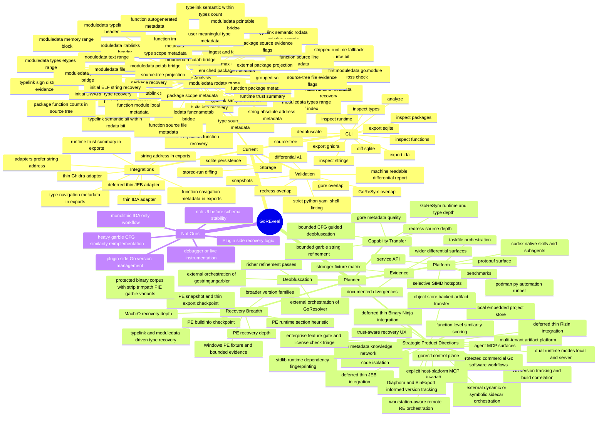

# GoREveal Feature Map

> Status: historical navigation snapshot; active authority is the [RT1 design](../superpowers/specs/2026-07-22-goreveal-rt1-product-design.md)
> Date: 2026-03-19
> Purpose: provide a high-signal map of what GoREveal already does, what is planned, and what is intentionally delegated to other tools or kept out of scope.

## Preliminary Status

At this point `GoREveal` is no longer a blank-platform plan. It is already a working container-first analysis stack with:
- canonical analysis schema
- end-to-end CLI
- real Go `ELF` fixture coverage
- SQLite persistence and stored-run diffing
- differential validation against multiple baselines
- staged `golangci-lint` policy imported from `gobfd`
- green `make lint` on top of the imported `gobfd` policy
- portable repo-local Codex skills and subagents
- Podman-first task orchestration through `Taskfile.yml` and `scripts/dev/podman_runner.py`
- strict script verification through `ruff`, `ty`, `yamllint`, and `shellcheck`
- stable `IDA` and `Ghidra` export contracts
- thin, fixture-validated `IDA` and `Ghidra` adapters

The main remaining gap is not “missing basic plumbing”. The main gap is evidence breadth:
- more differential coverage
- more truthful recovery breadth across formats and version families
- clearer boundaries between “native GoREveal capability” and “external tool orchestration”
- a deliberate capability-transfer roadmap from external Go RE utilities into native GoREveal functionality

## Comparative Assessment

Relative to the baseline tools, the current product shape is asymmetric:
- compared with `gore` and `redress`, `GoREveal` is already competitive or better as a platform product because it has canonical schema, persistence, differential reports, and export-driven integrations
- compared with `GoReSym`, `GoREveal` is no longer empty on runtime truth, but it is still clearly behind in real semantic runtime/type recovery
- compared with `GoResolver` and `gostringungarbler`, `GoREveal` has the right architecture for refined/deobfuscated layers, but not yet the same depth of deobfuscation capability
- compared with `AlphaGolang`, `GoREveal` has a cleaner integration boundary, but a thinner analyst UX inside the RE tools

The most important strategic conclusion is:
- the project is no longer bottlenecked by product plumbing
- it is now bottlenecked by runtime-semantic accuracy depth
- the first semantic foothold now exists, so the next best work is careful semantic extension, not more bounded evidence by default
- after the second semantic step, that conclusion still holds: the product should continue deepening `Sprint 12` before pivoting to another major lane
- after the current `.gopclntab` chain checkpoint, that conclusion becomes narrower: `Sprint 12` remains primary, but blind same-fixture bridge expansion should pause until either a second fixture or a heuristic-cross-check is ready
- the broader market lesson is also clear: `GoREveal` should not try to beat `IDA` / `Ghidra` / `JEB` / `Binary Ninja` as a generic RE suite; it should become the best Go-native recovery, trust, and transfer layer that plugs into them

See also:
- `docs/plans/2026-03-20-goreveal-functional-assessment.md`
- `docs/plans/2026-03-20-goreveal-progress-assessment.md`
- `docs/plans/2026-03-20-goreveal-next-bounded-analyst-slices-plan.md`
- `docs/plans/2026-03-20-goreveal-deferred-continuation.md`
- `docs/plans/2026-03-20-goreveal-market-killer-features-brainstorm.md`
- `docs/plans/2026-03-21-goreveal-runtime-modes-and-storage-ideas.md`
- `docs/plans/2026-03-31-goreveal-strategic-review.md`

## Feature Map

## What We Already Do

### Analysis Core

- `analyze` returns a canonical schema payload for a binary
- format detection works for `ELF`, `PE`, and `Mach-O`
- build info recovery works directly through `debug/buildinfo`
- runtime metadata recovery now exposes low-risk `ELF` layout evidence for `firstmoduledata`, `.gopclntab`, `.typelink`, and `.go.module`
- runtime metadata now also exposes raw `typelink_count` as the first bounded typelink evidence
- runtime metadata now also exposes a bounded raw `typelink_sample`
- runtime metadata now also exposes raw `typelink_min_offset` and `typelink_max_offset`
- runtime metadata now also exposes raw `typelink_negative_count` and `typelink_non_negative_count`
- runtime metadata now also exposes a bounded `firstmoduledata`/`.go.module` cross-check plus raw `.go.module` header words
- runtime metadata now also exposes a bounded `moduledata` typelinks slice-header cross-check through `moduledata_typelink_slice_word_index`, `moduledata_typelink_len`, and `moduledata_typelink_cap`
- runtime metadata now also exposes `.itablink` section evidence and a bounded `moduledata` itablinks slice-header cross-check through `moduledata_itablink_slice_word_index`, `moduledata_itablink_len`, and `moduledata_itablink_cap`
- runtime metadata now also exposes a bounded `moduledata` memory-range block cross-check for `.noptrdata`, `.data`, `.bss`, and `.noptrbss`
- runtime metadata now also exposes a bounded `.rodata` range cross-check from `firstmoduledata`
- runtime metadata now also exposes a bounded `.text` range cross-check from `firstmoduledata`
- runtime metadata now also exposes the first semantic typelink bridge through a bounded rodata-relative resolution sample and in-range count
- runtime metadata now also exposes a confidence bit showing that all typelinks in the canonical fixture resolve within `.rodata` under the current bounded hypothesis
- runtime metadata now also exposes bounded `moduledata_types_range_word_index`, `moduledata_types_addr` / `moduledata_etypes_addr`, and typelink-in-types counters for the current fixture-local `types..etypes` hypothesis
- runtime metadata now also exposes a bounded `pcHeader` / `funcnametab` bridge through `moduledata_pcheader_addr`, `moduledata_pcheader_matches_gopclntab`, `moduledata_funcnametab_slice_word_index`, `moduledata_funcnametab_addr`, `moduledata_funcnametab_len`, `moduledata_funcnametab_cap`, and `moduledata_funcnametab_within_gopclntab`
- runtime metadata now also exposes a bounded `cutab` bridge through `moduledata_cutab_slice_word_index`, `moduledata_cutab_addr`, `moduledata_cutab_len`, `moduledata_cutab_cap`, and `moduledata_cutab_within_gopclntab`
- runtime metadata now also exposes a bounded `filetab` bridge through `moduledata_filetab_slice_word_index`, `moduledata_filetab_addr`, `moduledata_filetab_len`, `moduledata_filetab_cap`, and `moduledata_filetab_within_gopclntab`
- runtime metadata now also exposes a bounded `pctab` bridge through `moduledata_pctab_slice_word_index`, `moduledata_pctab_addr`, `moduledata_pctab_len`, `moduledata_pctab_cap`, and `moduledata_pctab_within_gopclntab`
- runtime metadata now also exposes a bounded `pclntable` bridge through `moduledata_pclntable_slice_word_index`, `moduledata_pclntable_addr`, `moduledata_pclntable_len`, `moduledata_pclntable_cap`, and `moduledata_pclntable_within_gopclntab`
- runtime metadata now also exposes a compact `trust_summary`, so the current runtime posture is readable as `symbol_backed`, `go_module_fallback`, `section_heuristic`, or `absent`
- thin `IDA` and `Ghidra` export payloads now also mirror canonical `runtime.trust_summary`, keeping host-tool consumers on the same bounded runtime posture contract
- the current `.gopclntab` bridge chain is now dense enough that the next best move is a checkpoint, not another same-shape bridge by default
- the next breadth checkpoint should be a bounded Windows `PE` fixture before more same-fixture runtime bridge expansion
- that bounded Windows `PE` checkpoint is now started through a real `fixture.exe` plus `debug/buildinfo` and `analyze` coverage without any `PE` runtime recovery claim
- that same bounded `PE` checkpoint is now also pinned by snapshot coverage and thin export CLI coverage
- that same bounded `PE` checkpoint now also exposes `.text` / `.rdata` ranges, a raw `.rdata` `pclntab` magic candidate, and one header-looking `.rdata` `pclntab` candidate with raw `magic`, `quantum`, and `pointer_size` under `trust_summary: "section_heuristic"`
- runtime metadata now also supports a bounded `.go.module`-based `firstmoduledata` fallback for the current stripped ELF fixture family
- runtime metadata now also exposes `firstmoduledata_from_go_module_fallback`, making that stripped-fixture fallback source explicit to operators
- stripped-fixture package UX now keeps `main` as a useful module-local package by reusing `build_info.path` when source-tree evidence is absent, while external packages keep direct `import_path` truth from function recovery
- stripped-fixture type UX now degrades to `[]` instead of JSON `null`, making the missing `DWARF` surface explicit without pretending runtime type decoding exists
- stripped-fixture source-tree UX now returns a bounded fallback root plus module-local and external package nodes with empty file lists instead of failing outright
- function recovery is working for the current `ELF` fixture via `.gopclntab`
- function metadata now exposes `package`, direct non-`main` `import_path`, and bounded `module_local` truth for `main` via `build_info.path`
- function metadata now also exposes bounded `source_file` truth from the existing `pclntab` line table
- function metadata now also exposes bounded `source_line` truth from the same line table
- function metadata now also exposes bounded `autogenerated` truth for synthetic functions whose current truthful source file is `<autogenerated>`
- package recovery is working
- package metadata now exposes non-`main` `import_path` directly from recovered package names and adds `source_file_count` when source-tree evidence exists
- package metadata now includes `module_local`, so module-owned packages and external/runtime packages are explicit
- package metadata also has a bounded build-info fallback for `main` when source-tree evidence is absent
- package metadata now also exposes explicit `has_source_evidence`, distinguishing source-backed package truth from bounded fallback metadata
- type recovery exists in an initial truthful form via `DWARF`
- type metadata now includes `package` and `user_meaningful` hints without dropping the raw type surface
- type metadata now also includes `import_path` and `module_local`, aligning type navigation with package navigation
- type metadata now also includes `source_file_count`, making source-backed type scope explicit
- type metadata also has a bounded build-info fallback for `main` when a truthful type surface exists without source-tree evidence, while non-`main` types keep direct `import_path` truth from parsed type packages
- canonical `analyze` output now shows `types: []` when no truthful type surface exists, instead of silently omitting the field
- the new semantic typelink bridge is intentionally not yet wired into package/type metadata; current package/type heuristics remain source-tree/DWARF-backed on purpose
- string recovery exists in an initial truthful form via `ELF` data-section scanning
- string candidates now also expose bounded absolute `addr` truth by combining existing region base addresses with candidate offsets
- source-tree projection is working from `DWARF` file paths filtered by module path
- source-tree package nodes now aggregate multiple files per import path instead of creating one package node per file
- source-tree package nodes now carry package-level `function_count`
- source-tree package nodes now also carry explicit `has_file_evidence`, distinguishing real file-backed nodes from bounded empty-files fallback nodes
- source-tree now also exposes non-module `DWARF` source paths as explicit `external_packages`, including standard-library/runtime evidence when present

### CLI Surface

- `goreveal analyze`
- `goreveal inspect functions`
- `goreveal inspect runtime`
- `goreveal inspect packages`
- `goreveal inspect types`
- `goreveal inspect strings`
- `goreveal source-tree`
- `goreveal deobfuscate`
- `goreveal export sqlite`
- `goreveal export ida`
- `goreveal export ghidra`
- `goreveal diff sqlite`
- first bounded function matching through `matched_functions`, with exact-name, source-location, source-file, and module-local normalized-name matches over canonical function surfaces

### Persistence and Comparison

- SQLite-backed storage of canonical analysis
- loadable stored analyses
- stored-run schema-level diff summary

## Strategic Product Directions

These are not all immediate roadmap items, but they are now the most important medium- and long-term product directions.

### Best Near-Term Differentiator

- `Go code peeling / user-code isolation`
- goal: separate likely user-owned code from stdlib, runtime, and third-party dependency bulk
- market value: extremely high, because Go binaries are noisy and mainstream RE suites do not solve this problem in a Go-native way
- first landed slice: engine-owned function classification through `analysis.peeling` and `inspect peeling`, now extended with package-level summaries, per-class function counts, explicit `classification_evidence`, and the first bounded stdlib/runtime fingerprint-assisted refinement

### Best Mid-Term Workflow Epic

- `Go version tracking / build correlation`
- first landed slice: `diff sqlite` now emits bounded function matches with `score` and `reason`, using exact-name, source-location, source-file, and module-local normalized-name matching without any decompiler dependency
- goal: transfer recovered truth, labels, and analyst markup across related Go builds and families
- market value: very high, especially for malware RE, product security, and internal fleet analysis

### Best Long-Term Moat

- `Go metadata knowledge network`
- goal: private/team-hosted reuse of trusted Go metadata, similar in spirit to `Lumina` or `WARP` but Go-native and provenance-aware
- market value: very high, because it compounds over time and turns repeated analysis into reusable institutional knowledge

### Product Directions That Stay Deferred

- thin `JEB` integration
- thin `Binary Ninja` integration
- Go-aware dynamic evidence import
- deeper obfuscation workbench

These stay below current `Sprint 12` priority and should only be pulled forward when the runtime/type truth layer is materially stronger.

### Validation

- golden snapshots
- container-first regression flow
- staged `golangci-lint` policy rebased from `gobfd`, now integrated cleanly enough to keep `make lint` green
- differential evidence against:
  - `GoReSym`
  - `redress` module path plus a narrow source projection overlap
  - `gore`
- currently proven user-function overlap includes `main.main`, `main.helperAdd`, and `main.helperBanner` where the baseline surface exposes them
- machine-readable differential report output for the canonical fixture

### External Capability Transfer

- `gore`
  - already partially absorbed for build info, package presence, source-file basename overlap, and narrow function overlap
  - already partially absorbed for package `import_path` and `source_file_count` enrichment from source-tree evidence
  - already partially absorbed for user-type metadata that separates module-local type signal from runtime-heavy background noise
  - already partially absorbed for type `import_path` and `module_local` navigation metadata
  - next native target: broader package/type metadata truth from less heuristic sources
- `redress`
  - already partially absorbed for source projection, package presence, and module-path parity
  - already partially absorbed for grouped package/file projection, package-level `function_count`, and explicit external-package visibility
  - next native target: deeper source reconstruction beyond the new grouped package/file and external-package projection
- `GoReSym`
  - already partially absorbed for runtime-aware function/file truth on the current fixture
  - already partially absorbed for the first bounded `moduledata` typelinks slice-header cross-check against `.typelink` section evidence
  - already partially absorbed for the first bounded `moduledata` itablinks slice-header cross-check against `.itablink` section evidence
  - already partially absorbed for the first bounded `moduledata` memory-range block cross-check against ELF data/bss section boundaries
  - already partially absorbed for the first bounded `.rodata` range cross-check against ELF section boundaries
  - already partially absorbed for the first bounded `.text` range cross-check against ELF section boundaries
  - already partially absorbed for the first bounded `types..etypes` range bridge, explicit `moduledata_types_range_word_index`, and typelink-in-types counters on the canonical fixture
  - already partially absorbed for the first bounded `pcHeader` / `funcnametab` bridge into `.gopclntab` on the canonical fixture
  - already partially absorbed for the first bounded `cutab` bridge inside `.gopclntab` on the canonical fixture
  - already partially absorbed for the first bounded `filetab` bridge inside `.gopclntab` on the canonical fixture
  - already partially absorbed for the first bounded `pctab` bridge inside `.gopclntab` on the canonical fixture
  - already partially absorbed for the first bounded `pclntable` bridge inside `.gopclntab` on the canonical fixture
  - next native target: `moduledata` and `typelinks`-driven recovery depth
- `GoResolver`
  - not yet natively absorbed in a meaningful way
  - future target: bounded deobfuscation transfer, not full CFG engine cloning
- `gostringungarbler`
  - not yet natively absorbed beyond early refined string handling
  - future target: bounded garble-aware string refinement
- `AlphaGolang`
  - already partially absorbed through thin export-driven IDA/Ghidra import workflows
  - already partially absorbed for direct address-carrying string exports, so thin RE-tool adapters do not need to reconstruct string locations
  - already partially absorbed for function navigation metadata in exports, so thin RE-tool adapters can see package/source locality without plugin-side inference
  - already partially absorbed for type navigation metadata in exports, so thin RE-tool adapters can see package/scope/source-evidence context without plugin-side inference
  - already partially absorbed for adapter-side preference of canonical string `address`, so comment placement no longer throws away stronger export truth
  - future target: better thin-adapter UX, not plugin-side analysis

### Thin Integrations

- stable `IDA` export contract
- stable `Ghidra` export contract
- thin Python `IDA` adapter with fixture-driven validation
- thin Python `Ghidra` adapter with fixture-driven validation
- deferred backlog for a thin `JEB` integration layer over the same canonical export contract
- deferred backlog for a thin `Binary Ninja` integration layer over the same canonical export contract family

## What Is Planned

### Recovery Expansion

- broader and more truthful recovery across Go version families
- real parity work for `PE` and `Mach-O`, not just format recognition
- migration from minimal `DWARF` type recovery toward typelink/moduledata-driven recovery where possible

### Differential Expansion

- broader overlap surfaces with existing baselines
- more explicit divergence notes
- stronger evidence before making compatibility or superiority claims

### Deobfuscation Expansion

- richer native refinement passes
- optional orchestration of external deobfuscation tools where they are better than a rushed in-house reimplementation
- selective native transfer from `gostringungarbler` and `GoResolver`, but only where it preserves the raw/refined truth boundary

### Platform Expansion

- service/API surface
- protobuf-oriented machine interface
- benchmark harness
- selective SIMD work on measured hotspots only

## What We Intentionally Will Not Do Ourselves

These are not “missing features”. They are deliberate boundaries.

### Not In Plugin Code

- plugin-side recovery logic
- plugin-side deobfuscation logic
- plugin-side Go version management
- plugin-side reimplementation of the core analysis pipeline

Reason:
- plugins should import stable contracts, not become second analysis engines

### Not In The Early Product Line

- rich web/TUI
- live instrumentation
- debugger workflows
- binary rewriting
- mandatory CGO-heavy architecture

Reason:
- they dilute the accuracy-first platform focus

### Better Covered By Other Tools Today

- deep CFG-similarity symbol recovery on garble-obfuscated binaries
  - covered better by `GoResolver`
- heavy literal deobfuscation for garble string protection
  - covered better by `gostringungarbler`
- legacy/IDA-centric heuristic workflows and historical step-by-step scripts
  - covered by `AlphaGolang` and historically by `golang_loader_assist`

GoREveal may orchestrate or compare against these tools, but that does not mean their internals belong inside GoREveal core or plugins.

## Strategic Reading Of The Plan

When reading the Scrum plan, the easiest mental model now is:

1. `Sprint 1-6` gave us a working schema-first analysis platform.
2. `Sprint 7` is about proving what we already claim.
3. `Sprint 8` gave us usable contract-driven integrations.
4. next major value comes from either:
   - widening evidence
   - transferring more external utility capability into native `GoREveal`
   - widening truthful recovery
   - or adding machine-facing API surface

It does **not** come from making plugins fatter.

## Current Answer About IDA Pro Wrapping

Yes. In the current `GoREveal` design, the integration layer around `IDA Pro` is only Python.

More precisely:
- current `IDA` integration is a thin Python adapter
- it consumes `goreveal export ida` payloads
- it builds import actions and applies them through a minimal API surface
- it does not contain recovery logic

That is intentional, not provisional sloppiness.

The current architectural position is:
- `GoREveal core` does recovery
- `export ida` defines the stable contract
- `plugins/ida` imports that contract into IDA

We are **not** currently building:
- a C++ IDA plugin
- an SDK-heavy native plugin
- an IDA-side Go analysis engine

If that ever changes, it should be justified by concrete limits of the thin adapter model, not by default preference.
